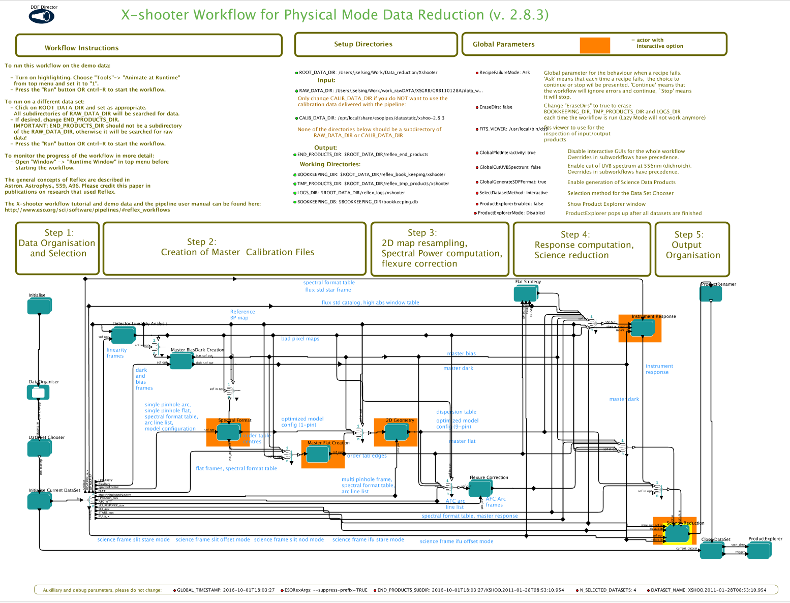
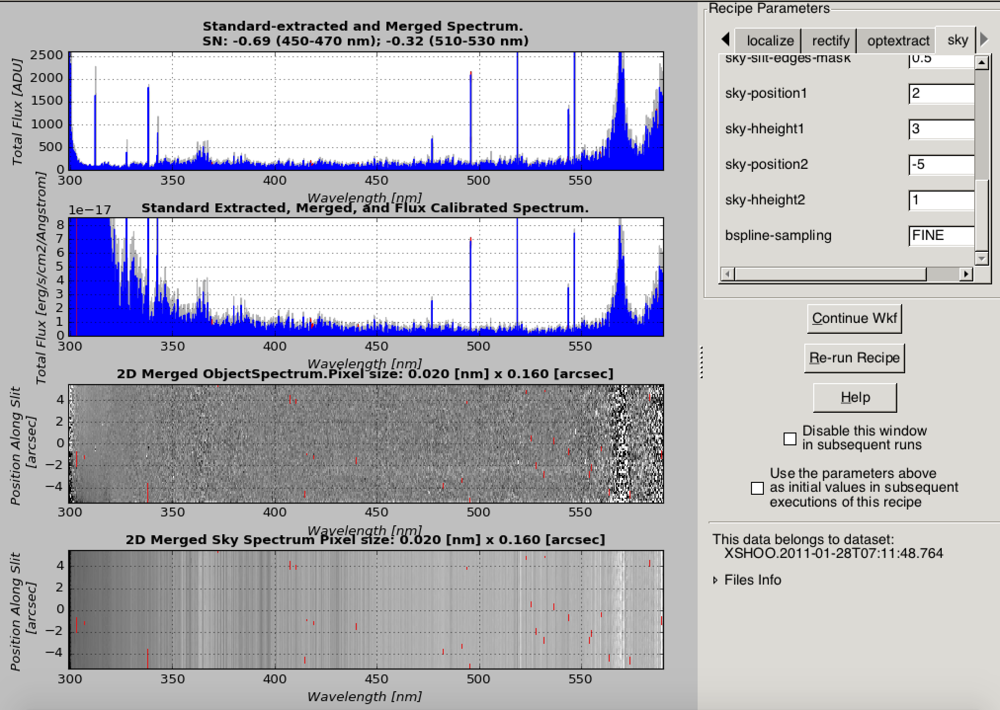
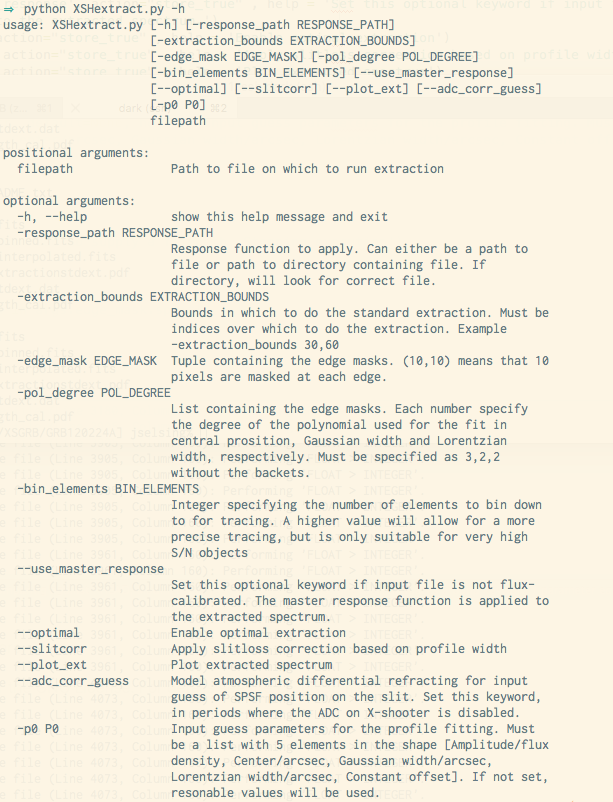

# XSGRB_reduction_scrips
Scripts created for the uniform reduction of GRB afterglows as part of the XSGRB collaboration

If you want to make use of this material, please contact me at jselsing@dark-cosmology.dk. If you find any bugs or missing features, please let me know.

-------
## Usage

The two main scripts in the package are XSHcomp.py and XSHextract.py. These take care of combinations of individual exposures and 1D-extractions respectively. The idea is that the ESO X-shooter pipeline, http://www.eso.org/sci/software/pipelines/, is used to reduce all observations in STARE-mode, and then the scripts provided here, do combinations and extractions where the X-shooter pipeline behaves sub-optimally. Additionally, a script is provided to run AstroScrappy on the raw data-files before they are fed to the ESO pipeline.

## Start using reduction scripts

First, reject cosmics in the raw images by running cosmic_removal.py. The path to your data has to be set, but it automatically runs the rejection algorithm only on the science images. 

Install the ESO pipelines through macports. Install instructions are available at https://www.eso.org/sci/software/pipelines/installation/macports.html.

The workflow used for these X-shooter reductions can be downloaded from this repository. The file XSGRB_workflow.xml contains the workflow. When esoreflex and installed and the workflow is loaded into Kepler (ESO workflow engine), it should look something like this:

Follow the instrutions printed on the workflow. Most importantly set the RAW_DATA_DIR to the folder containing your unzipped data. The workflow provided here has been preconfigured to reduce the observations in STARE-mode. 

During processing of the workflow, two quality-control windows are shown. The flux-standard reduction where the response function is computed and the science object reduction. The flux-standard window should be inspected for agreement between the blue and the green lines, signifying that the standard star has been adequately calibrated. The blue line is the nightly, flux-calibrated standard star and the green line tabulated flux for this star. 

For the science reduction, mainly the sky regions should be set for each element in the nodding sequence. It could look something like this, where a faint trace of the afterglow is visible, centered at -2.5 arcsec. The sky is specified using the sky_position and sky-hheight. For this example, two sky windows have been chosen, one at 2 arcsecond with a half-height of 3 arcseconds, and one at -5 arcsec with a 1 arcsec half-height.

Each complete nodding sequence will produce 4 individual reductions for each arm. The scrips combine these reductions. A specific directory structure makes the combinations much easier. The structure is shown here.

When this directory structure is used, the scripts can be run from the commandline using:

example usage

$
python XSHcomb.py /Users/jselsing/Work/work_rawDATA/XSGRB/GRB161023A/ UVB STARE OB1 -seeing 2.0
$

and 

$
python XSHextract.py /Users/jselsing/Work/work_rawDATA/XSGRB/GRB161023A/UVBOB1skysub.fits  --optimal --slitcorr --plot_ext --adc_corr_guess
$

## License
-------

Copyright 2016-2020 Jonatan Selsing and contributors.

These scripts are free software made available under the GNU License. For details see
the LICENSE file.
